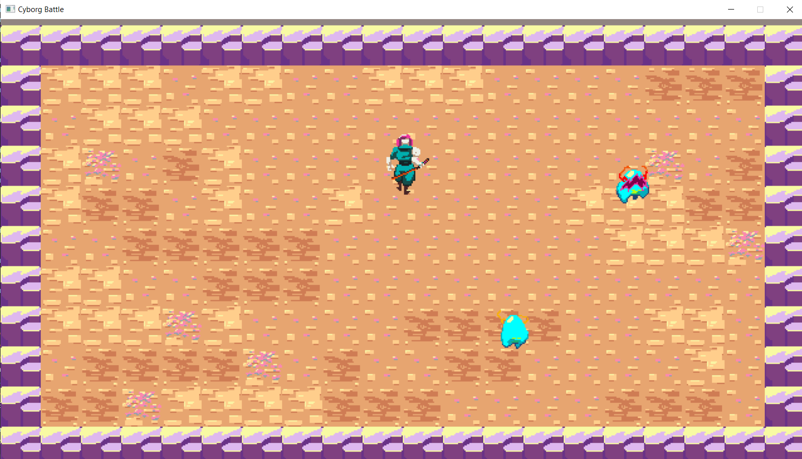
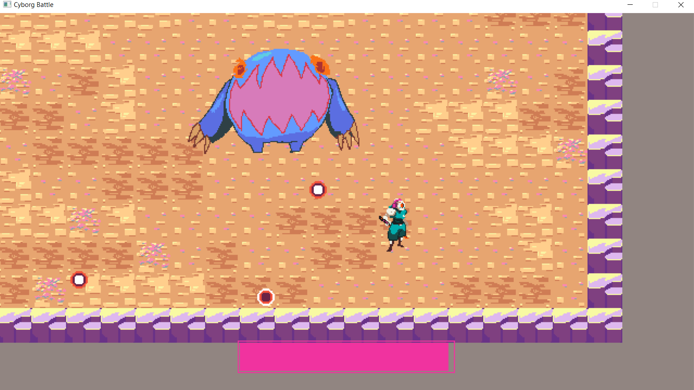

# HackNSlashTutorial

A simple 2D Top Down action packed game. It is more for learning purpose. It uses the SDL2 library.

Here you can download and install [SDL2](https://www.libsdl.org/).

To run the project you can clone it, unzip and open it in visual studio, and start debugging or build it.

The assets used in this does not belong to me, they are rather provided by the learning resource that I followed.

The basic controls for now are up arrow key, down arrow key, left down arrow key and right down arrow key. 

Z for Attack, and X for Dash.

Here you can see some of the screenshots of the game : 

